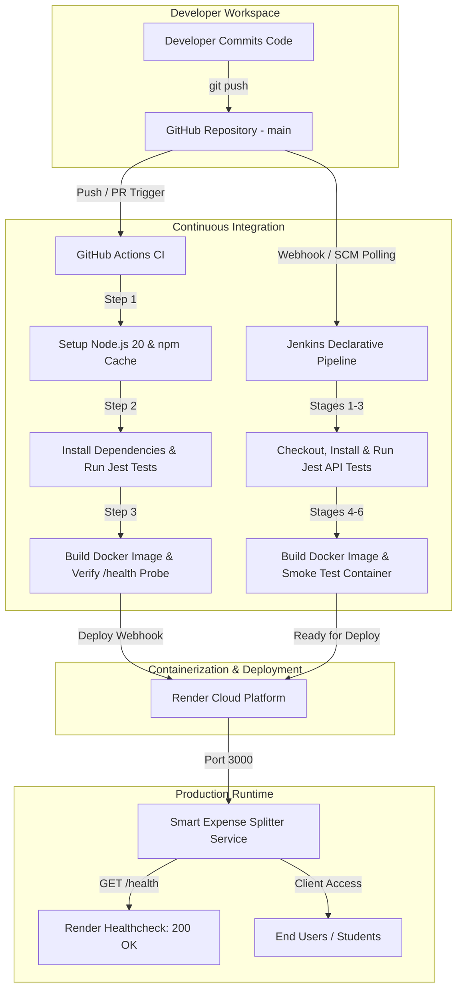

# 💸 Smart Expense Splitter

> **Production-Ready Smart Expense Splitter with Automated CI/CD Pipeline**  
> **Course:** MIT-WPU TY BTech CSE &mdash; Cloud Computing & DevOps (CCD / AIES LCA-2)  
> **Deployment Flow:** `GitHub → GitHub Actions / Jenkins → Docker → Render Cloud`

---

## 📌 1. Project Overview

**Smart Expense Splitter** is a modern, responsive, full-stack financial utility designed to track, split, and optimize shared expenses for roommates, travel groups, and collaborative student teams.

Beyond basic equal splits, the application provides percentage allocations, custom rupee distributions, real-time analytics with Chart.js visualizations, and a **greedy min-cash-flow algorithm (Smart Settlement Optimizer)** that reduces complex inter-member debt chains into the absolute minimum number of settlement transactions.

The project demonstrates enterprise DevOps practices: automated unit/integration testing with Jest and Supertest, containerization with Node.js 20 Alpine multi-stage Docker builds, continuous integration via GitHub Actions and Jenkins, and zero-downtime deployment on Render Free Tier.

---

## ✨ 2. Features

### Core Capabilities
- 👥 **Group Member Management:** Register and manage group participants dynamically.
- 💳 **Expense Operations (CRUD):** Add, view, edit, and delete shared group expenses.
- ➗ **Multiple Split Modes:**
  - **Equal Split:** Distributes expense amounts equally with penny-remainder preservation.
  - **Percentage Split:** Verifies exact 100% allocation across selected participants.
  - **Custom Split:** Allows custom rupee allocations validated against the total amount.
- 📜 **Search, Filter & Sort:** Search by description or category with real-time UI updates.
- ⚖️ **Net Balance Summary:** Real-time calculation of total paid, total owed, and net balances.

### Advanced Capabilities
- 🧠 **Smart Settlement Optimizer (Min-Cash-Flow):** Greedy algorithm that calculates the fewest peer-to-peer transfers needed to settle all debts.
- 📊 **Spending Insights & Chart.js:** Dashboard summary cards (*Total Expense, Highest Spender, Average Expense*) and category breakdown charts.
- 🔒 **Multi-Room Workspace Isolation:** Supports independent room sessions via `x-group-id` headers and scoped tokens.
- 📤 **Export Capabilities:** Export settlement transactions and expense data.

---

## 💻 3. Technology Stack

| Layer | Technologies |
| :--- | :--- |
| **Backend & Runtime** | Node.js (v20), Express.js 4.x |
| **Testing & QA** | Jest 29, Supertest 7 (17 automated integration test suites) |
| **Containerization** | Docker, Docker Compose, Alpine Linux (`node:20-alpine`) |
| **Continuous Integration** | GitHub Actions (`actions/setup-node@v4`), Jenkins (Declarative Pipeline) |
| **Cloud Hosting** | Render Free Tier (Docker Web Service Runtime) |
| **Frontend UI/UX** | HTML5, CSS3 Modern Dark Theme, Vanilla JavaScript, Chart.js |

---

## 🏗️ 4. CI/CD Pipeline Workflow



---

## 🚀 5. Local Installation Steps

### Prerequisites
- [Node.js](https://nodejs.org/) (v20 or higher recommended)
- [npm](https://www.npmjs.com/) (v10 or higher)
- [Git](https://git-scm.com/)

### 1. Clone the Repository
```bash
git clone https://github.com/<your-username>/smart-expense-splitter.git
cd smart-expense-splitter
```

### 2. Install Dependencies
```bash
npm install
```

### 3. Run Automated Tests
```bash
npm test
```

### 4. Start Local Development Server
```bash
npm start
```
Open your browser and navigate to `http://localhost:3000`.

---

## 🐳 6. Docker Run Commands

### 1. Build the Docker Image
```bash
docker build -t smart-expense-splitter:latest .
```

### 2. Run the Container
```bash
docker run -d -p 3000:3000 --name smart-expense-app smart-expense-splitter:latest
```

### 3. Verify Health Check Probe
```bash
curl http://localhost:3000/health
```
*Expected response:*
```json
{
  "status": "UP",
  "service": "smart-expense-splitter",
  "uptime": 10
}
```

### 4. Run with Docker Compose
```bash
docker compose up -d
```
To stop and remove containers:
```bash
docker compose down
```

---

## 🏗️ 7. Jenkins Pipeline Stages

The `Jenkinsfile` implements a robust cross-platform declarative CI/CD pipeline supporting both Windows and Linux agents:

1. **1. Checkout Repository:** Pulls the latest source code from the configured Git repository branch.
2. **2. Install Dependencies:** Runs clean `npm install` for project dependencies.
3. **3. Run Jest Tests:** Executes the Jest + Supertest suite with `--ci` and exports `test-results.json`.
4. **4. Build Docker Image:** Builds the multi-stage Docker container image tagged with `%BUILD_NUMBER%` and `latest`.
5. **5. Run Docker Container:** Starts a transient smoke-test container on port `3000`.
6. **6. Verify Health Endpoint:** Probes `GET /health` to guarantee HTTP 200 `UP` response.
7. **7. Archive Test Results & Cleanup:** Removes temporary containers, archives test artifacts, and triggers notifications.

---

## ☁️ 8. Render Deployment Steps

Render automatically builds and deploys the application directly from your GitHub repository using Docker runtime:

1. Push your latest code to the `main` branch of your GitHub repository.
2. Sign in to the [Render Dashboard](https://dashboard.render.com/) and click **New + → Web Service**.
3. Select and connect your `smart-expense-splitter` GitHub repository.
4. Fill in the service configuration:
   - **Name:** `smart-expense-splitter`
   - **Region:** Any preferred region (e.g., Singapore, Frankfurt, Oregon)
   - **Branch:** `main`
   - **Runtime:** `Docker`
   - **Plan Type:** `Free`
   - **Health Check Path:** `/health`
5. Click **Deploy Web Service**.
6. Render will automatically build the Dockerfile, execute the container health check, and publish your live URL (e.g., `https://smart-expense-splitter.onrender.com`).

---

## 🔌 9. REST API Reference

### Base URL: `http://localhost:3000`

| Method | Endpoint | Description |
| :--- | :--- | :--- |
| `GET` | `/health` | Service health status and uptime probe |
| `GET` | `/api/version` | API version and service name |
| `GET` | `/api/summary` | High-level summary (totalExpenses, totalMembers) |
| `GET` | `/api/categories` | Category-wise expense breakdown |
| `GET` | `/api/settlements/export`| Export optimized settlement transactions |
| `GET` | `/api/expenses` | Retrieve all expenses |
| `POST` | `/api/expenses` | Add a new expense (Equal, %, Custom) |
| `GET` | `/api/expenses/:id` | Get single expense details |
| `PUT` | `/api/expenses/:id` | Update an existing expense |
| `DELETE` | `/api/expenses/:id` | Delete an expense |
| `GET` | `/api/balances` | Member net balances & greedy settlement paths |
| `GET` | `/api/analytics` | Spending insights & category metrics |
| `GET` | `/api/members` | List registered group members |
| `POST` | `/api/members` | Add a new group member |
| `DELETE` | `/api/members/:name` | Remove a group member |
| `POST` | `/api/workspace/create` | Create a private room workspace |
| `POST` | `/api/workspace/join` | Join an existing room workspace |

---

## 📄 License

This project is licensed under the [MIT License](LICENSE).
