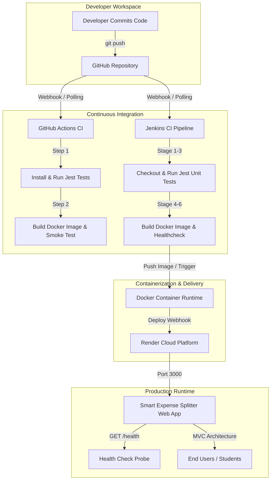

# 💸 Smart Expense Splitter &middot; MIT-WPU LCA-2

> **Production-Ready Smart Expense Splitter with Automated CI/CD Pipeline**  
> **Course:** MIT-WPU TY CSE &mdash; Cloud Computing & DevOps (CCD) / AIES LCA-2  
> **Pipeline Flow:** `GitHub → Jenkins → Docker → Render`

---

## 📌 1. Project Overview

**Smart Expense Splitter** is a modern, responsive, full-stack financial utility designed to track, split, and optimize shared expenses for roommates, student teams, and trips. 

Beyond standard equal splits, it provides percentage and custom amount splits, real-time analytics, Chart.js spending visualizations, and a **greedy min-cash-flow algorithm (Smart Settlement Optimizer)** that reduces complex inter-member debt chains into the absolute minimum number of reimbursement transactions.

The project demonstrates enterprise DevOps practices: automated linting, unit/integration testing with Jest and Supertest, containerization with multi-stage Docker builds, automated CI pipelines with GitHub Actions and Jenkins, and zero-downtime deployment to Render Cloud.

---

## 🎯 2. Problem Statement & Objectives

### Problem Statement
In group living and collaborative college projects, tracking shared costs often leads to confusion, manual calculation errors, and unnecessary multi-hop debt transactions (e.g., A owes B, B owes C, C owes A).

### Objectives
1. **Accurate Cost Sharing:** Support Equal, Percentage (sum = 100%), and Custom splits with penny-perfect accuracy.
2. **Optimal Debt Resolution:** Compute minimum cash-flow transfers to settle all group debts in the fewest transactions.
3. **Automated CI/CD:** Establish an automated delivery pipeline (`GitHub → Jenkins → Docker → Render`) where every commit is tested, containerized, and deployed automatically.

---

## ✨ 3. Features

### Core Features
- 👥 **Group Member Management:** Add/remove members with instant badge rendering and validation.
- 💳 **Expense Operations (CRUD):** Add, view, edit, and delete shared expenses.
- ➗ **Multiple Split Modes:**
  - **Equal Split:** Distributes cost equally with penny remainder distribution.
  - **Percentage Split:** Verifies exact 100% distribution among selected members.
  - **Custom Split:** Allows custom rupee allocations validated against the total amount.
- 📜 **Search & Filter:** Instant search by description, payer, or category with real-time UI updates.
- ⚖️ **Net Balance Summary:** Real-time calculation of total paid, total owed, and net balance.

### 🌟 Bonus Features
1. **Smart Settlement Optimizer (Min-Cash-Flow):** Uses a greedy optimization algorithm to resolve debts with the minimum number of transactions.
2. **Monthly Spending Insights & Chart.js:** Dashboard metrics (*Total Expense, Highest Spender, Average Expense, This Month Expense*) and an interactive category distribution Pie Chart.
3. **Export Report (PDF & CSV):** Download complete expense records as CSV or launch print-ready PDF statements.

---

## 🏗️ 4. System Architecture & CI/CD Pipeline



---

## 📁 5. Folder Structure

```text
smart-expense-splitter/
│
├── public/                     # Frontend Client Files
│   ├── index.html              # Glassmorphism UI Structure
│   ├── style.css               # Design System & Responsive Styling
│   ├── script.js               # Client-side MVC Controller & Chart.js
│   └── assets/                 # Vector Graphics & Icons
│       ├── logo.svg
│       ├── avatar-default.svg
│       └── empty-state.svg
│
├── routes/                     # Express REST API Routes
│   ├── expenseRoutes.js        # /api/expenses and /api/members
│   ├── balanceRoutes.js        # /api/balances
│   └── analyticsRoutes.js      # /api/analytics
│
├── controllers/                # Request Handlers
│   ├── expenseController.js
│   ├── balanceController.js
│   └── analyticsController.js
│
├── services/                   # Business Logic & Algorithms
│   ├── splitCalculator.js      # Split Computation (Equal, %, Custom)
│   └── settlementService.js    # Greedy Min-Cash-Flow Settlement Engine
│
├── middleware/                 # Request Pipeline Middleware
│   ├── logger.js               # HTTP Request Logger
│   └── validateExpense.js      # Strict Payload Validation Middleware
│
├── models/                     # Data Layer
│   └── expenseModel.js         # In-memory Thread-safe Data Store
│
├── test/                       # Automated Test Suites
│   └── app.test.js             # Jest + Supertest (11 Passing Tests)
│
├── .github/
│   └── workflows/
│       └── ci.yml              # GitHub Actions Workflow
│
├── app.js                      # Express App Configuration
├── server.js                   # Server Listener Entrypoint
├── package.json                # Dependencies & Scripts
├── Dockerfile                  # Multi-Stage Node.js 20 Alpine Dockerfile
├── docker-compose.yml          # Local Container Orchestration
├── Jenkinsfile                 # Declarative 9-Stage Jenkins CI Pipeline
├── .gitignore                  # Git Ignore Rules
├── .dockerignore               # Docker Ignore Rules
├── .env.example                # Sample Environment Variables
├── README.md                   # Project Documentation
└── LICENSE                     # MIT License
```

---

## 🔌 6. REST API Documentation

### Base URL: `http://localhost:3000`

| Method | Endpoint | Description |
| :--- | :--- | :--- |
| `GET` | `/health` | Service health status & commit metadata |
| `GET` | `/api/expenses` | Retrieve all expenses (supports `search`, `category`, `splitType`) |
| `GET` | `/api/expenses/:id` | Get details of a single expense |
| `POST` | `/api/expenses` | Add a new expense (validates payer, splits, amounts) |
| `PUT` | `/api/expenses/:id` | Update an existing expense |
| `DELETE` | `/api/expenses/:id` | Delete an expense |
| `GET` | `/api/balances` | Get member balances and optimized settlement paths |
| `GET` | `/api/analytics` | Get spending cards data and category breakdown |
| `GET` | `/api/members` | Get all registered group members |
| `POST` | `/api/members` | Register a new member |
| `DELETE` | `/api/members/:name` | Remove a member |

### Sample Payload: `POST /api/expenses`

```json
{
  "description": "Team Dinner at Cafe",
  "amount": 1200,
  "paidBy": "Alice",
  "category": "Food",
  "date": "2026-09-25",
  "splitType": "PERCENTAGE",
  "participants": ["Alice", "Bob", "Charlie"],
  "splitDetails": {
    "Alice": 50,
    "Bob": 25,
    "Charlie": 25
  }
}
```

---

## 🧪 7. Local Development & Testing

### Prerequisites
- Node.js (v20+)
- npm

### 1. Install Dependencies
```bash
npm install
```

### 2. Run Test Suite (Jest + Supertest)
```bash
npm test
```

### 3. Start Local Server
```bash
npm start
```
Visit `http://localhost:3000` in your browser.

---

## 🐳 8. Docker Instructions

### 1. Build Docker Image
```bash
docker build -t smart-expense-splitter:latest .
```

### 2. Run Docker Container
```bash
docker run -d -p 3000:3000 --name smart-expense-app smart-expense-splitter:latest
```

### 3. Check Container Health
```bash
curl http://localhost:3000/health
```

### 4. Run with Docker Compose
```bash
docker compose up -d
```
To stop:
```bash
docker compose down
```

---

## 🏗️ 9. Jenkins CI/CD Pipeline

The included `Jenkinsfile` defines a 9-stage declarative pipeline tested for Windows and Linux Jenkins environments:

1. **Checkout Repository:** Clones latest code from Git.
2. **Install Dependencies:** Executes `npm install`.
3. **Run Jest Tests:** Executes API tests and exports JSON test metrics.
4. **Build Docker Image:** Creates tagged Docker image.
5. **Run Docker Container:** Spins up container on port 3000 for smoke testing.
6. **Verify Health Endpoint:** Validates `GET /health` returns HTTP 200 `UP`.
7. **Archive Test Results:** Stores test reports and cleans temporary containers.
8. **Post Success:** Triggers deployment ready signal.
9. **Post Failure:** Cleans workspace and notifies logs.

---

## 🚀 10. Render Deployment Guide

1. Push your repository to **GitHub**.
2. Log in to [Render](https://render.com) and click **New + → Web Service**.
3. Connect your GitHub repository.
4. Configure the settings:
   - **Environment:** `Docker`
   - **Branch:** `main`
   - **Health Check Path:** `/health`
   - **Plan:** Free
5. Click **Create Web Service**. Render will automatically build the Dockerfile and deploy the application.

---

## 🔮 11. Future Scope

- 📱 Multi-currency exchange rate live conversion via open rates API.
- 🧾 Optical Character Recognition (OCR) receipt scanning with Gemini API.
- 🔒 Group authentication and invite links via JWT.

---

## 📄 License

This project is licensed under the [MIT License](LICENSE).
